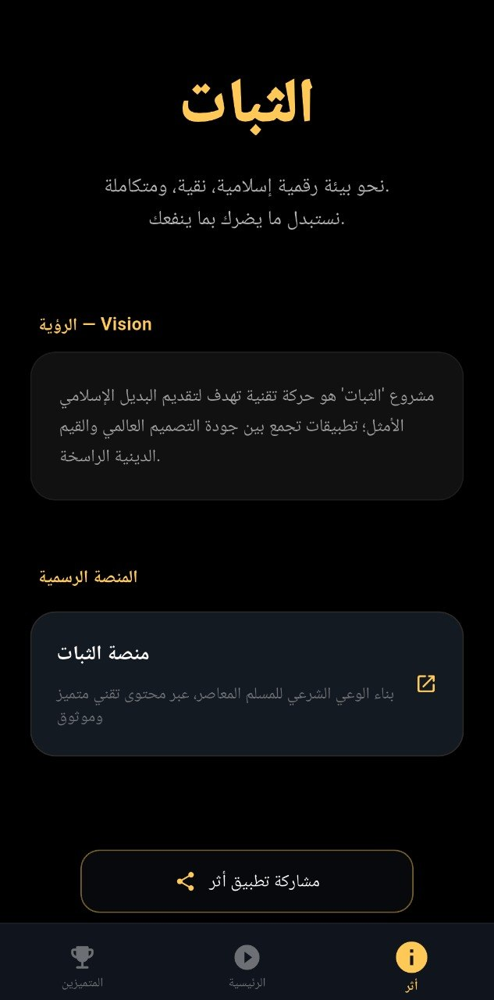
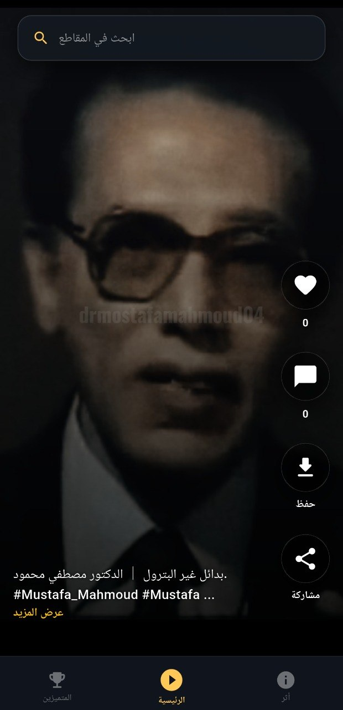
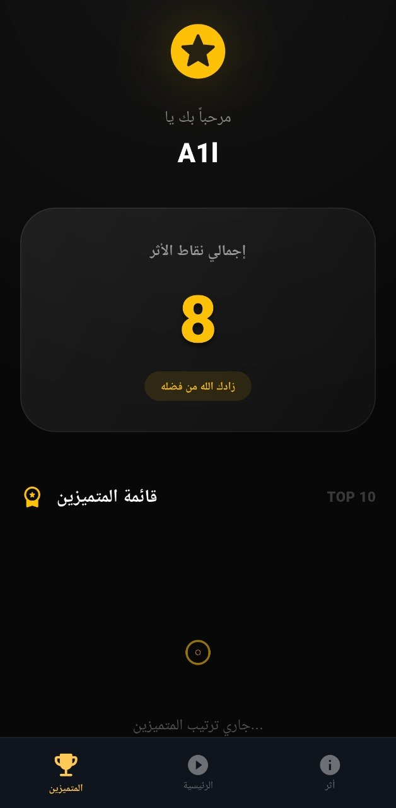

# أثر - بديل إسلامي للمحتوى القصير

---

## عن التطبيق
**أثر** هو تطبيق محتوى قصير مستوحى من فكرة تطبيق التيكتوك لكن بهدف مختلف: محتوى يترك أثر نافع .

- 🎥 فيديوهات قصيرة هادفة
- 📿 محتوى ديني وتذكير يومي
- ❤️ تفاعل بسيط بدون إدمان
- 🌙 تصميم مريح وخالي من المشتتات

---

## 🚀 التحميل

  

---

## 🖼️ لقطات من التطبيق

| الرئيسيه | الحساب | الفديو |
|----------|--------|--------|
|  |  |  |

---

## 🎯 الهدف
تحويل وقت التمرير العشوائي إلى وقت فيه فائدة، يزرع فيك أثر بدل ما يسرق عمرك.

---

> "فمن يعمل مثقال ذرة خيرًا يره"
